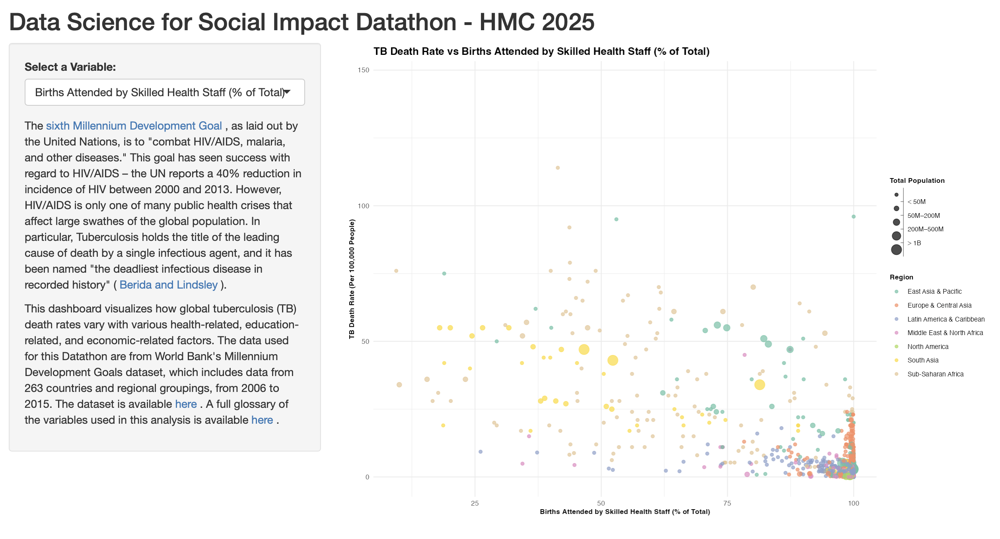
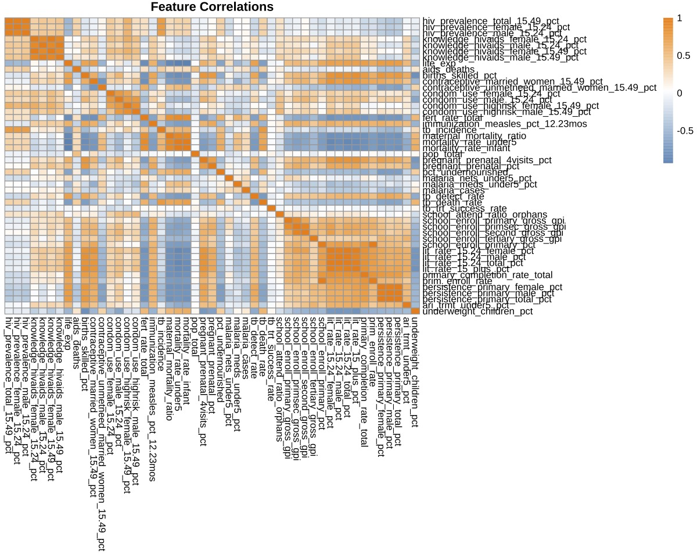

# DSSI_Datathon
Here you can find the data and code used in our (Charlotte Imbert and Emrys King) submission for the 2025 Harvey Mudd College Data Science for Social Impact Datathon. Our task was to create data visualizations to draw conclusions about global factors affecting economic development using the World Bank’s Millennium Development Goals data (2006-2015).

Code for our Shiny dashboard (visualizing how global tuberculosis death rates with various economic, educational and health factors) is available in the dssi_app folder.

Datathon_EDA.Rmd contains the code for data wrangling.

